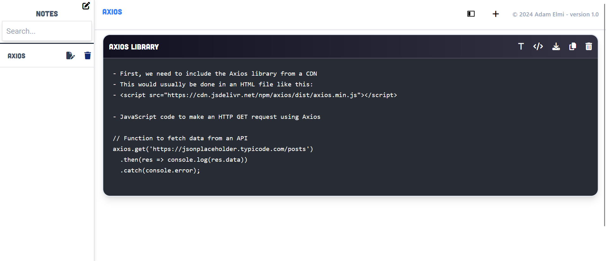
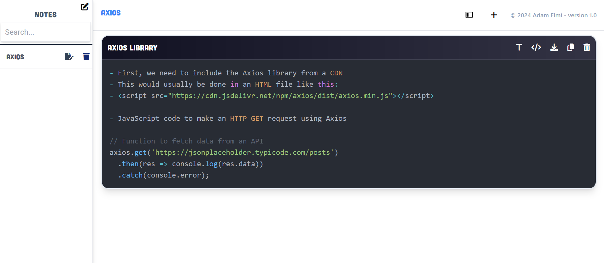

# Code Note
- A note taking app designed for personal use, now shared for everyone to utilize.
- Initially created for personal note-taking, now open for others to benefit from.
#### Text input mode:

#### Readonly mode:

### Key Features
- **Separate Text Input**: Create multiple text inputs.
- **Code Highlighting**: Make text inputs readonly with code highlighted.
- **Text File Download**: Download your notes as text files.
- **Clipboard Copy**: Quickly copy text to your clipboard.
- **Note Deletion**: Remove unwanted notes or text inputs.
- **Note Search**: Easily find specific notes using the search function.

### Contributing
- **Open Contribution**: This project welcomes contributions to improve existing features or introduce new ones.

### Licensing
- **MIT License**: Code Note is licensed under the MIT License, ensuring freedom to use, modify, and distribute.